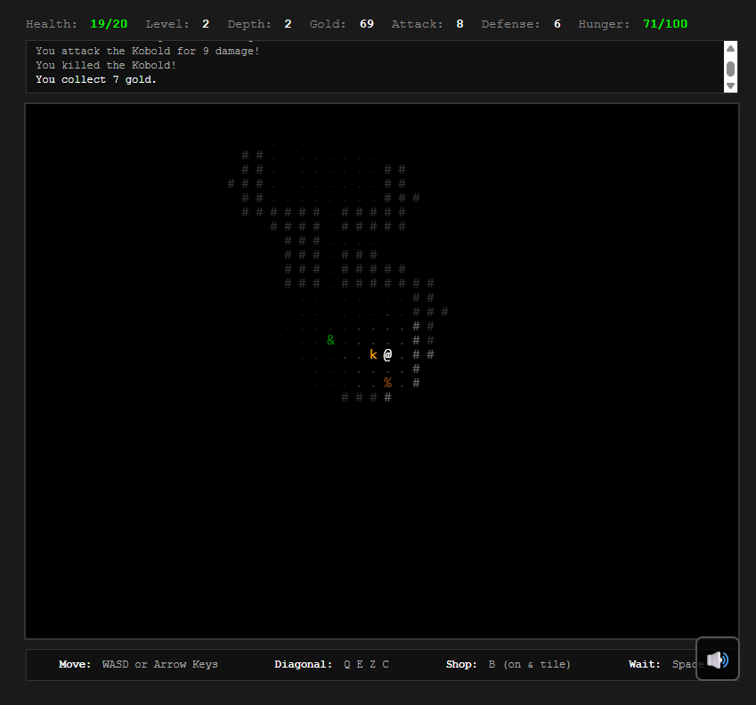

# Vault of Shadows - Dungeon Crawler Game


> A modern reimagining of the classic 1980's Rogue, built with a custom HTML5 Canvas engine and 100% Vanilla JavaScript.



## 📜 About

**Vault of Shadows** combines the strategic depth of traditional roguelikes with a modern, polished aesthetic. Unlike typical ASCII games, it features a custom-built rendering engine that generates procedural graphics, atmospheric lighting, and glassmorphism UI elements—all without a single external image asset.

The game is built to demonstrate how complex game systems (procedural generation, field-of-view algorithms, entity-component systems) can be implemented in pure JavaScript with modern tooling (Vite, ES Modules).

### Key Features
- **♾️ Infinite Scaling**: No level caps. Monsters and equipment scale exponentially.
- **⚔️ Tactical Combat**: Turn-based battles with critical hits, status effects, and positioning strategy.
- **👹 Boss Encounters**: Unique boss mechanics every 3 levels (Summoners, Enragers, Teleporters).
- **🎨 Procedural Visuals**: 3D-styled walls, dynamic lighting, and particle effects generated in code.
- **🏰 Complex Dungeons**: Special rooms including Monster Nests, Treasuries, Libraries, and Shops.

---

## 🛠️ Technology Stack

The project adheres to a "No Dependencies" philosophy for the runtime, using only native web technologies.

- **Core**: Vanilla JavaScript (ES2022+)
- **Architecture**: ES Modules (ESM)
- **Rendering**: HTML5 Canvas API (Custom `Renderer` class with tile caching)
- **Audio**: Web Audio API (Procedural sound synthesis)
- **Build Tooling**: Vite 7.3.0 (Hot Module Replacement, Minification)
- **Styling**: Modern CSS3 (Variables, Flexbox/Grid, Glassmorphism)

---

## 🏗️ Architecture Overview

The codebase is organized into modular components following a clean separation of concerns:

```mermaid
graph TD
    Game[Game Loop (game.js)] --> Input[Input Handler]
    Game --> Dungeon[Dungeon Generator]
    Game --> Renderer[Rendering Engine]
    Game --> Combat[Combat System]
    
    Dungeon --> Rooms[Room Generation]
    Combat --> Monster[Monster AI]
    Combat --> Player[Player Stats]
    
    Renderer --> Canvas[HTML5 Canvas]
    Renderer --> Cache[Tile Cache]
```

### Core Systems

| Module | Description |
|--------|-------------|
| `game.js` | Central coordinator. Manages the game loop (`requestAnimationFrame`), turn system, and state transitions. |
| `dungeon.js` | Implements **BSP (Binary Space Partitioning)** inspired algorithms to generate connected rooms, corridors, and special areas. |
| `renderer.js` | A high-performance drawing engine. Uses an off-screen canvas cache to render complex procedural tiles (walls, floors) only once to optimize FPS. |
| `monster.js` | Contains the **AI Behavior Tree**. Monsters can hunt, flee, patrol, or use special abilities based on their type and health. |
| `GameCombat.js`| Handles the math behind damage calculations, armor penetration, RNG, and applying status effects (Burn, Stun, Poison). |
| `GameUI.js` | Manages the DOM-based UI overlay, updating health bars, logs, and inventory slots without triggering canvas redraws. |

---

## 🚀 Getting Started

### Prerequisites
- Node.js (v16.0.0 or higher)
- npm (v7.0.0 or higher)

### Installation

1. **Clone the repository**
   ```bash
   git clone https://github.com/Samrude1/Vault-of-Shadows.git
   cd Vault-of-Shadows
   ```

2. **Install dependencies**
   ```bash
   npm install
   ```

3. **Run Development Server**
   Start the local Vite server with HMR:
   ```bash
   npm run dev
   ```
   Open `http://localhost:5173` in your browser.

4. **Build for Production**
   Generate minimized assets for deployment:
   ```bash
   npm run build
   ```
   Output files will be in the `dist/` directory.

---

## 🎮 How to Play

**Objective**: Descend to **Level 10**, defeat the Amulet Guardian, retrieve the **Amulet of Yendor**, and escape back to the surface.

### Controls
| Action | Keyboard |
|--------|----------|
| **Move** | `W`, `A`, `S`, `D` or Arrow Keys |
| **Diagonal** | `Q`, `E`, `Z`, `C` |
| **Wait** | `Space` (Skip turn / Rest) |
| **Interact** | Bump into enemies to attack / items to pickup |
| **Shop** | Press `B` when standing on Shop tile (`⌂`) |
| **Use Item** | Press `U` to use selected item |

### Mechanics Tips
- **Fog of War**: You can only see what your character physically sees. Unexplored areas are black.
- **Momentum**: Waiting (`Space`) heals a small amount of HP but costs food (Hunger).
- **Strategy**: Use choke points in corridors to fight enemies one by one.
- **Elements**: Use Fire scrolls on Treants and Freeze scrolls on grouped enemies.

---

## 💻 Technical Highlights

### 1. Procedural Rendering
Instead of loading sprite sheets, the game draws everything using `CanvasRenderingContext2D`.
```javascript
// Example: Creating a wall tile procedurally
// renderer.js
drawWall(x, y, isVisible) {
    const color = this.hslToHex(hue, saturation, lightness); // Dynamic lighting
    this.ctx.fillStyle = color;
    this.ctx.fillRect(x * TILE, y * TILE, TILE, TILE);
    // ... adds 3D highlights and shadows
}
```

### 2. Recursive Difficulty Scaling
To support infinite levels, monsters scale recursively rather than linearly:
```javascript
// GameCombat.js
hp = baseHP * Math.pow(1.15, level - 1); // Exponential growth
damage = baseDmg + (level * 1.5);
```

### 3. Smart Tile Caching
To maintain 60FPS on mobile, the `Renderer` class caches generated tile textures. If a wall at `x,y` hasn't changed visibility, it redraws the cached image instead of recalculating vector paths.

---

## 📄 License

This project is licensed under the **ISC License**. See the [LICENSE](LICENSE) file for details.

---

*Found a bug? Open an issue on [GitHub](https://github.com/Samrude1/Vault-of-Shadows/issues).*
