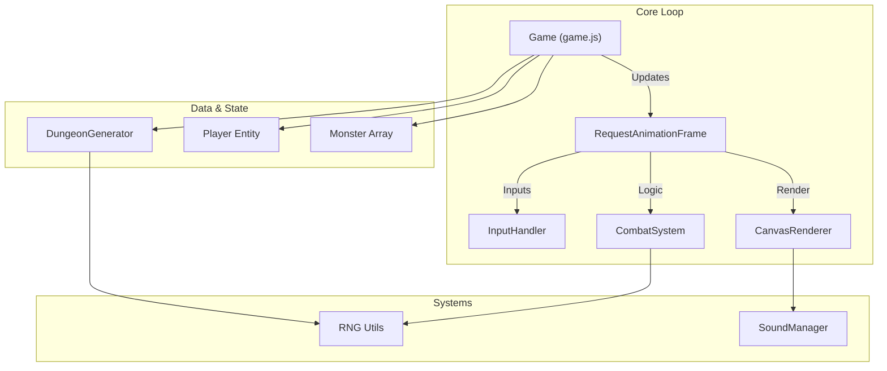

# Vault of Shadows - The Ultimate Developer's Guide


> **"A masterclass in generative design and vanilla JavaScript architecture."**


## 📑 Table of Contents

1. [📜 Lore & Setting](#-lore--setting)
2. [🤖 Technology Stack](#-technology-stack)
3. [✨ Key Features](#-key-features)
4. [📘 Game Mechanics Manual](#-game-mechanics-manual)
    - [Stats & Formulas](#stats--formulas)
    - [Combat System](#combat-system)
    - [Monster Bestiary](#monster-bestiary)
    - [Item Catalog](#item-catalog)
    - [Dungeon Generation](#dungeon-generation)
5. [🔊 Audio Engine Specification](#-audio-engine-specification)
6. [🏗️ Architecture & Technical Design](#-architecture--technical-design)
    - [System Overview](#system-overview)
    - [Component Architecture](#component-architecture)
    - [Rendering Pipeline](#rendering-pipeline)
    - [Algorithmic Deep Dive](#algorithmic-deep-dive)
7. [👨‍💻 Developer Reference (API)](#-developer-reference-api)
    - [Core Classes](#core-classes)
    - [Utility Functions](#utility-functions)
    - [Data Structures](#data-structures)
8. [🔌 Extension Guide](#-extension-guide)
    - [Adding New Monsters](#adding-new-monsters)
    - [Creating Custom Items](#creating-custom-items)
9. [🚀 Installation & Setup](#-installation--setup)
10. [🎮 Controls](#-controls)
11. [🆘 Troubleshooting](#-troubleshooting)
12. [📅 Project History](#-project-history)
13. [📄 License](#-license)

---

## 📜 Lore & Setting

**The Legend of the Vault**

Centuries ago, the mad sorcerer Yendor constructed a subterranean labyrinth to hide his most prized possession: **The Amulet of Yendor**. It is said that the Amulet grants its wielder dominion over death itself. Many adventurers have entered the Vault of Shadows, but none have returned.

The dungeon is not merely a physical place; it is a shifting, living entity. The walls rearrange themselves, monsters spawn from the darkness, and the very layout of the floors changes with every descent.

**Your Mission**:
You are a lone adventurer, equipped only with your wits and a rusty blade. You must descend to the **10th Floor**, defeat the Guardian, seize the Amulet, and escape with your life.

---

## 🤖 Technology Stack

**Vault of Shadows** is built to adhere to a strict "No Dependencies" philosophy for the runtime, relying only on standard Web APIs.

| Component | Technology | Description |
|-----------|------------|-------------|
| **Language** | JavaScript (ES2022) | Modern JS features (Classes, Modules, Async/Await). |
| **Rendering** | HTML5 Canvas 2D | Hardware-accelerated 2D graphics without WebGL overhead. |
| **Audio** | Web Audio API | Real-time synthesis of sound effects (Oscillators, GainNodes). |
| **Build Tool** | Vite 7.3.0 | Fast HMR (Hot Module Replacement) and optimized bundling. |
| **Styling** | CSS3 / Glassmorphism | Modern CSS variables, flexbox, grid, and backdrop-filter. |
| **Input** | Keyboard Events | Native event listeners for responsive control. |

---

## ✨ Key Features

### ⚔️ Deep Combat System
*   **Tactical Turn-Based Action**: The game waits for you. Plan every move carefully.
*   **Critical Hit Mechanics**: 10% chance to deal 200% damage, accompanied by screen shake and flash effects.
*   **Status Effect Engine**: A robust system managing temporal buffs and debuffs (Poison, Burn, Stun, Haste, Shield).
*   **Boss Encounters**: Every 3rd level features a unique boss with custom AI scripts.

### ♾️ Infinite Progression
*   **Uncapped Scaling**: Level cap removed in v3.1. Theoretically infinite dungeon depth.
*   **Recursive Difficulty**: Monster stats scale via compound interest formula `(1.25^Level)`.
*   **Dynamic Loot**: Weapons and armor generate stats based on the floor level they are found on.

### 🎨 Procedural Aesthetics
*   **Computed Graphics**: No spritesheets. Every pixel is drawn via canvas primitives (`rect`, `arc`, `path`).
*   **Atmospheric Lighting**: A Raycasting-based Fog of War system that hides unexplored areas.
*   **Particle Effects**: Simple particle systems for blood splatters and magic effects.

---

## 📘 Game Mechanics Manual

### Stats & Formulas

#### Player Attributes
| Stat | Base | Growth per Level | Formula | Notes |
|------|------|------------------|---------|-------|
| **HP** | 20 | +3 | `20 + (Lvl-1)*3` | +10% bonus every 10 levels. |
| **Attack** | 4 | +1 | `4 + (Lvl-1)*1` | Raw damage potential. |
| **Defense** | 2 | +1 | `2 + (Lvl-1)*1` | Flat damage reduction. |

#### Monster Scaling Formula
To ensure the game remains challenging indefinitely, monsters scale **exponentially**.

```javascript
// Monster Stat Formula
HP = BaseHP * Math.pow(1.25, Level - 1);
Attack = BaseAtk + (Level - 1) * 1.5;
Defense = BaseDef + (Level - 1) * 1.0;
```

#### Elite Monster Tiers (Level 10+)
Deep in the dungeon, you will encounter superior variants.

| Tier | Min Level | Chance | Visual | HP Mult | Atk Mult | Special |
|------|-----------|--------|--------|---------|----------|---------|
| **Veteran** | 10 | 20% | Standard | 1.3x | 1.15x | 1.5x XP |
| **Elite** | 20 | 25% | 🟧 Orange | 1.6x | 1.3x | +1 Def, 2x XP |
| **Champion** | 30 | 10% | 🟥 Red | 2.0x | 1.5x | +2 Def, 3x XP |

### Combat System

#### Damage Pipeline
1.  **Roll**: `1d4` (Random integer 1-4)
2.  **Base Damage**: `Roll + Attacker.Attack`
3.  **Critical Check**: `Math.random() < 0.10`
    *   If Crit: `Damage *= 2`
4.  **Mitigation**: `FinalDamage = Damage - Target.Defense`
5.  **Chip Damage**: `FinalDamage = max(FinalDamage, Damage * 0.10)`
    *   *Ensures high-defense targets still take at least 10% damage.*

#### Status Effects Table
| Effect | Icon | Duration | Implementation Effect |
|--------|------|----------|-----------------------|
| **Poison** | 💚 | 5 turns | `Target.takeDamage(1)` (Ignores Defense) |
| **Burn** | 🔥 | 3 turns | `Target.takeDamage(3)` (Ignores Defense) |
| **Stun** | 💫 | 1-2 turns | `Target.skipTurn = true` |
| **Haste** | ⏩ | 15 turns | Player gets 2 moves per world tick. |
| **Shielded** | 🛡️ | 10 turns | `Target.Defense *= 1.5` |
| **Empowered** | 💪 | 10 turns | `Target.Attack *= 1.5` |

### Monster Bestiary

| Icon | Name | Base HP | Base Atk | Base Def | Speed | AI Behavior |
|:----:|------|:-------:|:--------:|:--------:|:-----:|-------------|
| `k` | **Kobold** | 5 | 2 | 1 | 1.0 | **Basic**: Chases player directly. |
| `o` | **Orc** | 10 | 4 | 2 | 1.0 | **Warrior**: Standard melee unit. |
| `g` | **Goblin** | 6 | 2 | 1 | 1.0 | **Coward**: Flees at <30% HP. |
| `s` | **Skeleton** | 8 | 3 | 2 | 0.5 | **Slow**: Moves every 2nd turn. |
| `b` | **Bat** | 3 | 3 | 0 | 1.0 | **Flying**: 20% chance to pass walls. |
| `z` | **Zombie** | 15 | 4 | 1 | 1.0 | **Undead**: Regens 1HP/turn. Poisons. |
| `T` | **Troll** | 20 | 6 | 3 | 1.0 | **Brute**: High HP. Stuns on hit. |
| `D` | **Dragon** | 40 | 10 | 5 | 1.0 | **Boss**: Area Attack + Burn. Flying. |

#### Boss Encounters
*   **Lvl 3: Kobold King**: Summons 2 Kobold minions when at 50% HP.
*   **Lvl 6: Orc Warlord**: Enrages at 30% HP (+2 Attack, Flash effect).
*   **Lvl 9: Lich**: Teleports on hit (20% chance). Summons Skeletons every 3 turns.
*   **Lvl 10: Amulet Guardian**: Toggles invulnerability shield every other turn.
*   **Lvl 12: Ancient Dragon**: Massive stats, flies through walls, breathes fire (AOE).

### Item Catalog

#### Consumables
*   **Health Potion** (`!`): Restores 10 HP. Cost: 15g.
*   **Rations** (`%`): Restores 30 Hunger. Cost: 20g.
*   **Scrolls** (`?`):
    *   **Mapping**: Reveals floor.
    *   **Identify**: Shows all items.
    *   **Teleport**: Random location.
    *   **Fireball**: 3x3 AOE Damage.
    *   **Freeze**: Stuns enemies in range.

#### Equipment Generation
Items scale based on depth found.
*   **Weapons**: `ResultingAtk = BaseAtk + floor(Depth * 0.15)`
*   **Armor**: `ResultingDef = BaseDef + floor(Depth * 0.10)`

### Dungeon Generation

The `DungeonGenerator` class uses a **BSP-based Algorithm** (Binary Space Partitioning approximation):
1.  **Initialize Grid**: Fill `width x height` with Walls (`#`).
2.  **Room Placement**: Attempt to place 10 rectangular rooms of size 5-12.
    *   Check for overlap with existing rooms.
3.  **Connection**: Connect Room `N` to Room `N-1` using L-shaped corridors.
4.  **Special Room Assignment**:
    *   Rooms are assigned types based on RNG.
    *   **Types**: Normal (64%), Trap (10%), Nest (8%), Treasure (5%), Library (5%), Armory (5%), Shrine (3%).
5.  **Entities**: Place Stairs (`>`), Player (`@`), and monsters in random valid floor tiles (`.`).

---

## 🔊 Audio Engine Specification

The game features a fully procedural audio engine located in `js/sound.js`. It uses the **Web Audio API** to generate sound waves in real-time, meaning no `.mp3` or `.wav` files are loaded.

### Sound Synthesis Methods
All sounds are created using `OscillatorNode` and `GainNode`.

| Action | Waveform | Frequency Seq (Hz) | Envelopes | Description |
|--------|----------|--------------------|-----------|-------------|
| **Move** | `sine` | 200 | Fast decay | Soft footstep. |
| **Hit** | `sawtooth` | 150 | Medium decay | Gritty impact. |
| **Crit** | `square` | 150, 100 | Sharp attack | 8-bit "crunch" sound. |
| **Kill** | `sine` | 300, 400, 500 | Ascending | Positive feedback. |
| **Level Down** | `sine` | 200, 150, 100, 50 | Descending | "Falling" sound. |
| **Spell** | `triangle` | 600, 800, 1000 | Bell-like | Magical chime. |

```javascript
// Example: Generating a sound
playTone(frequency, duration, type) {
    const osc = audioContext.createOscillator();
    const gain = audioContext.createGain();
    osc.frequency.value = frequency;
    osc.type = type;
    gain.gain.exponentialRampToValueAtTime(0.01, duration); // Decay
    osc.connect(gain);
    gain.connect(dest);
    osc.start();
    osc.stop(time + duration);
}
```

---

## 🏗️ Architecture & Technical Design

### System Overview

The code is modular, using ES6 classes to separate concerns.



### Component Architecture

1.  **Game (`game.js`)**: The central controller.
    *   Manages the Game Loop.
    *   Handles Turn State (Player Turn vs Monster Turn).
    *   Maintains the "Source of Truth" for game state.
2.  **DungeonGenerator (`dungeon.js`)**:
    *   Pure function (mostly) that produces a 2D grid.
    *   Handles special room logic and shop placement.
3.  **Renderer (`renderer.js`)**:
    *   **Tile Caching**: Generates static images for walls/floors to optimize performance.
    *   **HSL Color Hashing**: Wall colors are deterministically generated based on position to create texture without assets.
4.  **GameCombat (`GameCombat.js`)**:
    *   Stateless logic for interactions.
    *   "Referee" for combat outcomes.
5.  **SoundManager (`sound.js`)**:
    *   Wrapper around `AudioContext`.
    *   Handles muting, volume, and synthesis.

### Rendering Pipeline
The `Renderer.render()` method is optimized for mobile performance.
1.  **Clear**: `ctx.clearRect()`
2.  **FOV Calculation**: Determine which tiles are visible to the player.
3.  **Draw Map**: Iterate `x` and `y` within the camera viewport.
    *   If tile is Wall/Floor: Draw from Cache.
    *   If tile is Item/Shop: Draw procedural icon.
4.  **Draw Entities**: Draw Monsters and Player on top.
5.  **Draw UI**: Render HTML overlay for Health/Message Log.

### Algorithmic Deep Dive: Combat
The combat system uses a "Chip Damage" system to prevent soft-locks.
*   **Problem**: If Player Def > Monster Atk, Player is invincible.
*   **Solution**: `max(Damage - Def, Damage * 0.1)`. Even if Defense is high, 10% of damage always leaks through.

---

## 👨‍💻 Developer Reference (API)

Documentation for core classes and methods.

### Core Classes

#### `class Game`
*   `init()`: Initialize canvas, listeners, and start first level.
*   `gameLoop()`: Main animation frame handler.
*   `playerTurn(dx, dy)`: Process player input. Returns true if action taken.
*   `monsterTurn()`: Iterate all monsters and execute AI.
*   `goToNextLevel()`: Reset dungeon, increment level, scale difficulty.

#### `class DungeonGenerator`
*   `constructor(width, height)`
*   `generate()`: Returns `grid[][]`
*   `placeShop()`: Inserts Shop tile (`&`) in a random valid room.
*   `getRoomAt(x, y)`: Returns Room Object `{x, y, w, h, type}`.

#### `class Monster`
*   `constructor(x, y, type, level)`
*   `static getStats(type)`: Returns base stats configuration.
*   `act(player, dungeon, monsters)`: Determining next move.
*   `takeDamage(amount)`: Applies damage, checks death, returns result object.

### Data Structures

**Monster Object**
```json
{
  "x": 10,
  "y": 15,
  "type": "orc",
  "level": 5,
  "health": 18,
  "maxHealth": 18,
  "tier": "normal",
  "stats": { ... }
}
```

**Item Object**
```json
{
  "x": 5,
  "y": 5,
  "type": "sword",
  "dungeonLevel": 3,
  "attackBonus": 4
}
```

---

## 🔌 Extension Guide

### Adding New Monsters
1.  **Define Stats**: Open `js/monster.js` and add entry to `getStats()` dictionary.
    ```javascript
    'demon': {
         name: 'Lesser Demon',
         health: 25, attack: 6, defense: 2,
         symbol: 'D', color: '#b91c1c',
         canFly: true
    }
    ```
2.  **Update Spawning**: Open `js/GameCombat.js` and add `'demon'` to `distribution` array in `selectMonsterType()`.

### Creating Custom Items
1.  **Define Data**: Open `js/item.js` `getItemData()`.
    ```javascript
    'mega_potion': {
        name: 'Elixir', symbol: '!', color: '#fff',
        description: 'Full Heal'
    }
    ```
2.  **Implement Logic**: In `item.js` `use()`.
    ```javascript
    case 'mega_potion':
        player.heal(player.maxHealth);
        return "You feel rejuvenated!";
    ```
3.  **Add to Drops**: In `monster.js` `getDropTable`.

---

## 🚀 Installation & Setup

### Prerequisites
*   **Node.js** v16+
*   **NPM** v7+

### Step-by-Step
1.  **Clone the Repo**
    ```bash
    git clone https://github.com/Samrude1/Vault-of-Shadows.git
    cd Vault-of-Shadows
    ```

2.  **Install Dependencies**
    ```bash
    npm install
    ```

3.  **Start Dev Server**
    ```bash
    npm run dev
    ```
    Open `http://localhost:5173`.

4.  **Build for Production**
    ```bash
    npm run build
    ```

---

## 🎮 Controls

### Keyboard Shortcuts
| Key | Action |
|-----|--------|
| `W` / `↑` | Move North |
| `A` / `←` | Move West |
| `S` / `↓` | Move South |
| `D` / `→` | Move East |
| `Space` | Wait (Skip Turn) |
| `Q`, `E`, `Z`, `C` | Diagonal Movement |
| `M` | Toggle Mute |
| `B` | Buy (in Shop) |
| `U` | Use Item |

---

## 🆘 Troubleshooting

**Audio not playing?**
*   Web Audio API requires a user interaction (click/keydown) to start.
*   Check if the muted icon is active (press `M`).

**Game stuck?**
*   Check console for errors (`F12`).
*   Refresh page (State is not persistent across reloads in this version).

**Build failing?**
*   Ensure Node.js is v16+.
*   Try deleting `node_modules` and running `npm install` again.

---

## 📅 Project History

*   **v3.2.2**: Deployment Fixes, ESM Refactor.
*   **v3.2**: Combat Rebalance scale fix.
*   **v3.1**: Infinite Scaling update.
*   **v3.0**: Mechanics Overhaul.
*   **v2.4**: Phase 2 Update (Bosses).
*   **v2.3**: Visual Update (Glassmorphism).
*   **v1.0**: Initial Release.

---

## 📄 License

**ISC License**

Copyright (c) 2026 Samrude1

Permission to use, copy, modify, and/or distribute this software for any purpose with or without fee is hereby granted, provided that the above copyright notice and this permission notice appear in all copies.

THE SOFTWARE IS PROVIDED "AS IS" AND THE AUTHOR DISCLAIMS ALL WARRANTIES WITH REGARD TO THIS SOFTWARE INCLUDING ALL IMPLIED WARRANTIES OF MERCHANTABILITY AND FITNESS. IN NO EVENT SHALL THE AUTHOR BE LIABLE FOR ANY SPECIAL, DIRECT, INDIRECT, OR CONSEQUENTIAL DAMAGES OR ANY DAMAGES WHATSOEVER RESULTING FROM LOSS OF USE, DATA OR PROFITS, WHETHER IN AN ACTION OF CONTRACT, NEGLIGENCE OR OTHER TORTIOUS ACTION, ARISING OUT OF OR IN CONNECTION WITH THE USE OR PERFORMANCE OF THIS SOFTWARE.

---

> *Crafted with code, coffee, and dungeons.*
